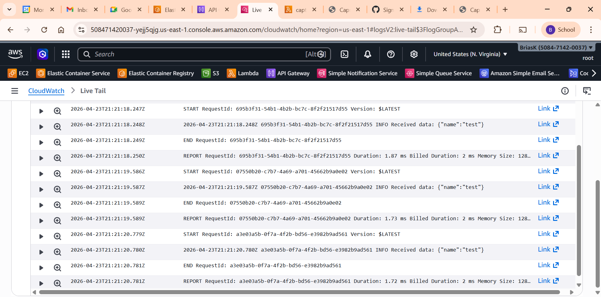

# Capstone Project: Serverless API & Containerized Web App on AWS

> **Week 1 Capstone** - A hybrid cloud-native application combining a Serverless REST API, a Containerized Web App deployed via Infrastructure as Code, and full observability through Amazon CloudWatch.

---

## Table of Contents

1. [Architecture Overview](#architecture-overview)
2. [Project Structure](#project-structure)
3. [Prerequisites](#prerequisites)
4. [Step 1 - Build & Push Docker Image to ECR](#step-1---build-push-docker-image-to-ecr)
5. [Step 2 - Deploy Infrastructure with CloudFormation](#step-2---deploy-infrastructure-with-cloudformation)
6. [Step 3 - Deploy the Lambda Function](#step-3---deploy-the-lambda-function)
7. [Step 4 - Configure API Gateway](#step-4---configure-api-gateway)
8. [Step 5 - Test the API](#step-5---test-the-api)
9. [Step 6 - Verify Observability (CloudWatch)](#step-6---verify-observability-cloudwatch)
10. [Screenshots](#screenshots)

---

## Architecture Overview

This project is built on four layers that together form a complete cloud-native solution:

| Layer | Service | Role |
|---|---|---|
| Infrastructure as Code | AWS CloudFormation | Provisions VPC, networking, ECS Cluster & Service |
| Containerized App | Amazon ECS (Fargate) + ECR | Hosts and serves the web application |
| Serverless API | AWS Lambda + API Gateway | Handles `POST /submit` requests and logs payloads |
| Observability | Amazon CloudWatch | Captures logs and visualizes Lambda metrics |

---

## Project Structure

```
.
├── infrastructure.yml          # CloudFormation template (VPC, ECS Cluster, Service, IAM)
├── lambda-api/
│   └── index.js                # Lambda function - handles POST /submit
├── webapp/
│   ├── Dockerfile              # Nginx-based container definition
│   └── index.html              # Web application served by ECS
├── screenshots/                # Evidence of working deployment
│   ├── ECS-running-on-browser.png
│   ├── API-gateway-response.png
│   ├── CloudWatch-logs.png
│   └── CloudWatch-Dashboards.png
└── README.md
```

---

## Prerequisites

Before deploying, make sure you have the following ready:

- An **AWS account** with sufficient permissions (IAM, ECS, ECR, Lambda, API Gateway, CloudFormation, CloudWatch)
- **AWS CLI** installed and configured (`aws configure`)
- **Docker** installed and running locally
- An **Amazon ECR repository** created for the web app image

---

## Step 1 - Build & Push Docker Image to ECR

Build the Docker image from the `webapp/` directory and push it to Amazon ECR so ECS can pull it during deployment.

```bash
# 1. Build the image locally
docker build -t capstone-week1 ./webapp

# 2. Authenticate Docker to your ECR registry
aws ecr get-login-password --region us-east-1 | \
  docker login --username AWS --password-stdin <your-account-id>.dkr.ecr.us-east-1.amazonaws.com

# 3. Tag the image with your ECR repository URI
docker tag capstone-week1:latest \
  <your-account-id>.dkr.ecr.us-east-1.amazonaws.com/capstone-week1:latest

# 4. Push the image to ECR
docker push <your-account-id>.dkr.ecr.us-east-1.amazonaws.com/capstone-week1:latest
```

> Replace `<your-account-id>` with your actual 12-digit AWS account ID.

---

## Step 2 - Deploy Infrastructure with CloudFormation

The `infrastructure.yml` template provisions the complete networking and ECS stack:

- Custom **VPC** with public subnet, Internet Gateway, and route table
- **Security Group** allowing inbound HTTP (port 80)
- **IAM Task Execution Role** with the `AmazonECSTaskExecutionRolePolicy` managed policy
- **ECS Cluster**, **Task Definition** (256 CPU / 512 MB, Fargate), and **ECS Service** (1 desired task)

**To deploy:**

1. Open the [AWS CloudFormation Console](https://console.aws.amazon.com/cloudformation)
2. Click **Create stack -> With new resources**
3. Upload `infrastructure.yml`
4. Set stack name: `capstone-ecs`
5. Click through and **Create stack**

Wait until the stack status shows **CREATE_COMPLETE**.

**To find the running app URL:**

1. Go to **ECS Console -> Clusters -> CapstoneCluster -> Tasks**
2. Click the running task
3. Copy the **Public IP** under the Network section
4. Open `http://<public-ip>` in your browser

---

## Step 3 - Deploy the Lambda Function

The Lambda function (`lambda-api/index.js`) accepts a JSON POST body, logs the payload to CloudWatch, and returns a unique submission ID.

```js
exports.handler = async (event) => {
    // Log the incoming request body to CloudWatch Logs
    console.log("Received data:", event.body);

    // Generate a random submission ID
    const submissionId = Math.random().toString(36).substring(2, 10);

    return {
        statusCode: 200,
        headers: { "Content-Type": "application/json" },
        body: JSON.stringify({
            message: "Data successfully received and logged!",
            id: submissionId
        })
    };
};
```

**To deploy:**

1. Go to **AWS Lambda Console -> Create function**
2. Select **Author from scratch**
3. Runtime: **Node.js 20.x**
4. Function name: `capstone-submit-handler`
5. After creation, paste the code from `lambda-api/index.js` into the inline editor (or upload as a `.zip`)
6. Click **Deploy**

---

## Step 4 - Configure API Gateway

Create a REST API that routes `POST /submit` requests to the Lambda function.

1. Go to **API Gateway Console -> Create API -> REST API**
2. API name: `capstone-api`
3. Create a resource: `/submit`
4. Create a method on `/submit`:
   - Method type: **POST**
   - Integration type: **Lambda Function**
   - Enable **Lambda Proxy Integration**
   - Select your `capstone-submit-handler` function
5. Click **Deploy API**:
   - Create a new stage named `prod`
6. Copy the **Invoke URL** - it will look like:
   ```
   https://<api-id>.execute-api.us-east-1.amazonaws.com/prod/submit
   ```

---

## Step 5 - Test the API

Use `curl` or any API client (e.g., Postman) to send a test POST request:

```bash
curl -X POST "https://<api-id>.execute-api.us-east-1.amazonaws.com/prod/submit" -H "Content-Type: application/json" -d "{\"name\":\"test\"}"
```

**Expected response:**

```json
{
  "message": "Data successfully received and logged!",
  "id": "a3f9c12b"
}
```

---

## Step 6 - Verify Observability (CloudWatch)

### Lambda Logs

1. Go to **CloudWatch Console -> Log groups**
2. Open `/aws/lambda/capstone-submit-handler`
3. Click a recent log stream and confirm you can see `Received data: {...}` entries

### CloudWatch Dashboard

1. Go to **CloudWatch Console -> Dashboards -> Create dashboard**
2. Name it `CapstoneMonitoring`
3. Add widgets:
   - **Lambda Invocations** - metric: `AWS/Lambda -> Invocations` filtered to `capstone-submit-handler`
   - **Lambda Errors** - metric: `AWS/Lambda -> Errors` filtered to `capstone-submit-handler`
4. Save the dashboard

---

## Screenshots

### ECS Web Application Running in Browser


### API Gateway - Successful POST /submit Response


### CloudWatch Logs - Lambda Payload Logging



### CloudWatch Dashboard - Lambda Invocations & Errors


---

## What Was Built

This capstone demonstrates a complete end-to-end cloud-native architecture on AWS:

- **CloudFormation** fully automates the provisioning of all networking and ECS resources - no manual console clicks required for infrastructure
- **Docker + ECR + ECS Fargate** delivers a containerized web app without managing any servers
- **Lambda + API Gateway** provides a scalable, event-driven API backend that costs nothing at idle
- **CloudWatch** gives full visibility into Lambda execution, errors, and invocation trends through logs and a live dashboard
