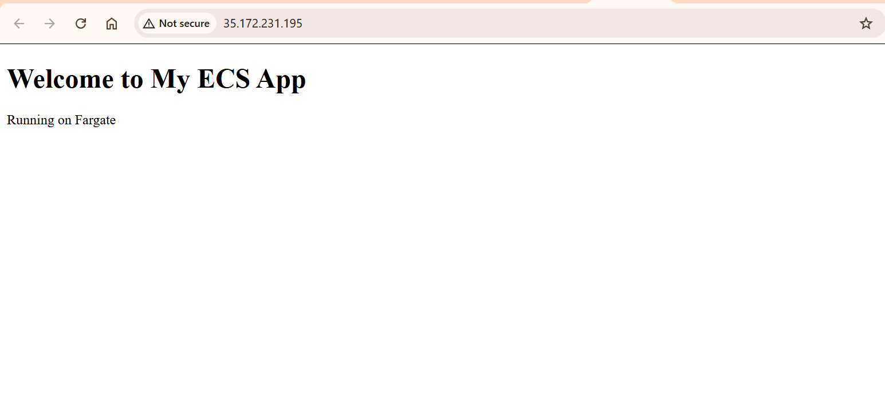
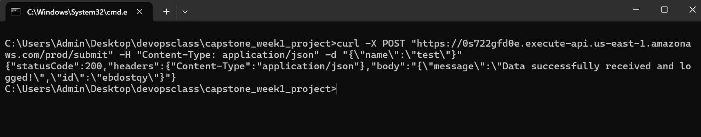
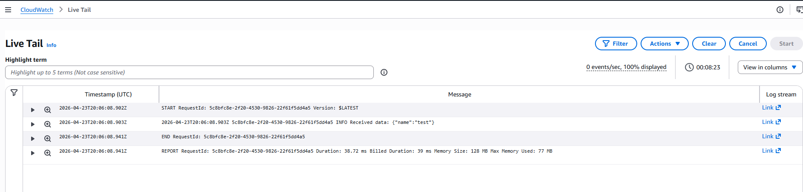
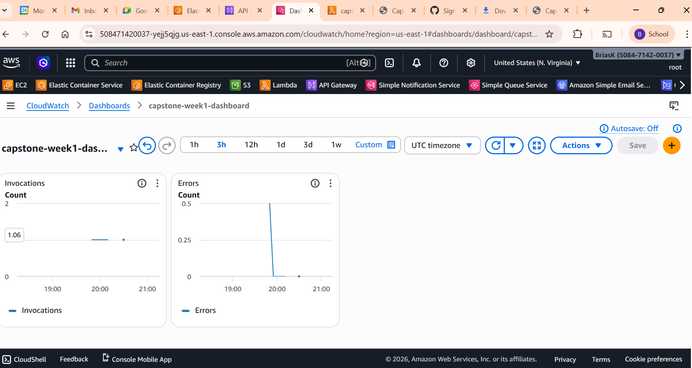

# Capstone Project: Hybrid Cloud-Native Application on AWS

## Overview

This project demonstrates a production-style hybrid cloud-native architecture on AWS, integrating containerized workloads, serverless computing, infrastructure as code, and observability.

It showcases how modern applications can be built using loosely coupled AWS services to achieve scalability, reliability, and operational visibility.

---

## Architecture

The solution is composed of four core layers:

### 1. Infrastructure as Code

* AWS CloudFormation provisions the entire ECS infrastructure
* Includes VPC, networking, ECS cluster, and service configuration

### 2. Containerized Application

* A lightweight web application built using Docker
* Image stored in Amazon ECR
* Deployed on Amazon ECS using Fargate (serverless containers)

### 3. Serverless API Layer

* AWS Lambda processes incoming requests
* Amazon API Gateway exposes a REST endpoint (`POST /submit`)
* Handles JSON payloads and returns structured responses

### 4. Observability

* Amazon CloudWatch Logs captures Lambda execution logs
* CloudWatch Dashboard visualizes:

  * Lambda invocations
  * Lambda errors

---

## Architecture Diagram

```
User → API Gateway → Lambda → CloudWatch Logs
     → ECS (Fargate Web App) → ECR Image
     → CloudFormation (Infrastructure Provisioning)
```

---

## Project Structure

```
.
├── infrastructure.yml
├── lambda-api/
│   └── index.js
├── webapp/
│   ├── Dockerfile
│   └── index.html
└── README.md
```

---

## Deployment Guide

### 1. Clone Repository

```bash
git clone https://github.com/briasbk/capstone_week1_project.git
cd capstone_week1_project
```

---

### 2. Build and Push Docker Image to ECR

#### Build Image

```bash
docker build -t capstone-webapp ./webapp
```

#### Authenticate to ECR

```bash
aws ecr get-login-password --region us-east-1 | docker login --username AWS --password-stdin <account-id>.dkr.ecr.us-east-1.amazonaws.com
```

#### Tag Image

```bash
docker tag capstone-webapp:latest <account-id>.dkr.ecr.us-east-1.amazonaws.com/capstone-webapp:latest
```

#### Push Image

```bash
docker push <account-id>.dkr.ecr.us-east-1.amazonaws.com/capstone-webapp:latest
```

---

### 3. Deploy Infrastructure (CloudFormation)

* Open AWS CloudFormation Console
* Create a new stack
* Upload `infrastructure.yml`
* Enter stack name: `capstone-ecs`

Wait for status:

```
CREATE_COMPLETE
```

---

### 4. Access ECS Web Application

* Navigate to ECS Console
* Open cluster → Tasks
* Select running task
* Copy public IP

Open in browser:

```
http://<public-ip>
```

---

### 5. Lambda Function Setup

Create a Lambda function using Node.js runtime:

```js
exports.handler = async (event) => {
    console.log("Received data:", event.body);

    const submissionId = Math.random().toString(36).substring(2, 10);

    return {
        statusCode: 200,
        headers: { "Content-Type": "application/json" },
        body: JSON.stringify({
            message: "Data successfully received and logged!",
            id: submissionId
        })
    };
};
```

---

### 6. API Gateway Configuration

* Create REST API
* Create resource: `/submit`
* Create method: `POST`
* Enable Lambda Proxy Integration
* Deploy to stage: `prod`

---

### 7. Test API

```bash
curl -X POST "https://<api-id>.execute-api.us-east-1.amazonaws.com/prod/submit" \
-H "Content-Type: application/json" \
-d "{\"name\":\"test\"}"
```

---

### 8. Observability (CloudWatch)

#### Logs

* Navigate to CloudWatch Logs
* Open Lambda log group
* Verify incoming request payloads

#### Dashboard

* Create CloudWatch Dashboard
* Add widgets:

  * Lambda Invocations
  * Lambda Errors

---

## Validation Results

* ECS Fargate service successfully running and accessible via public IP
* API Gateway successfully triggering Lambda function
* CloudWatch logs confirming request payload processing
* Dashboard displaying operational metrics

---

## Screenshots

### ECS Web Application



### API Gateway Response



### CloudWatch Logs



### CloudWatch Dashboard



---

## Key Learnings

* Infrastructure as Code using AWS CloudFormation
* Containerization and deployment using Docker and ECS Fargate
* Serverless API design using Lambda and API Gateway
* Cloud-native observability using CloudWatch

---

## Conclusion

This project demonstrates a complete end-to-end cloud-native architecture on AWS, combining serverless and container-based computing models. It reflects real-world cloud engineering practices for scalable and observable systems.

---
